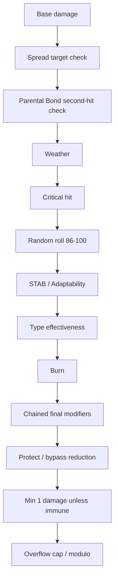
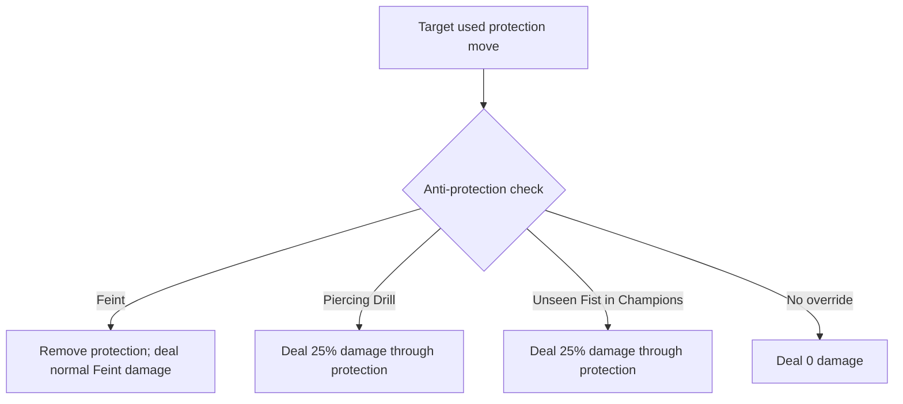

# Battle Damage Document — Pokémon Champions 2026 Mechanics Verification

> **Source:** Second-source verification report provided by project owner on 2026-04-24.
> **Purpose:** Independent cross-check of the mechanics assumed by `CHAMPIONS_MECHANICS_SPEC.md`. This document is the canonical reference shared with the partner engineer for reviewing engine logic, golden test cases, and damage pipeline decisions.
> **Status:** Approved as authoritative for damage/status/mega behavior where it confirms the locked spec. Conflicts with the locked spec are tracked in `CHAMPIONS_SPEC_DELTAS.md`.
> **Cross-references:**
> - `CHAMPIONS_MECHANICS_SPEC.md` — primary engineering spec (commit `2b15225`)
> - `CHAMPIONS_SPEC_DELTAS.md` — delta analysis + adopted changes

---

## Executive Summary

Highest-confidence mechanics for the current 2026 build of Pokémon Champions, with a bias toward sources that are either official or directly indexed from current game-guide databases. Critical implementation findings:

- Official competitive play is centered on Champions; Worlds 2026 uses Champions as VGC software
- VGC remains Level 50 doubles, bring-six / choose-four
- First Champions ranked regulations explicitly enable Mega Evolution
- Champions uses the standard 18-type chart, but surfaces the 4× and 0.25× cases with explicit labels **Extremely Effective** and **Mostly Ineffective**
- Modern damage pipeline is Gen V+, but current Bulbapedia mechanics entry specifically says Champions narrows the random roll from 85–100 to **86–100** — validator should expect **15 rolls**, not 16
- Protect is **8 PP**, and consecutive uses drop to **one-third** of the previous success rate
- Status conditions were intentionally nerfed for competitive play: paralysis, sleep, and freeze all changed

For simulator QA, the safest engineering posture is:
- Treat the base type chart as unchanged
- Treat current Champions Mega timing as once-per-battle transformation **before** move execution
- Implement damage as deterministic integer math with exact rounding order
- Block release on any mismatch in the exact roll set for golden tests

Remaining high-priority unknowns are narrow but important: exact in-game behavior of some new abilities such as **Spicy Spray**, exact scope of **Mega Sol**, and a likely data conflict in one public description of **Magic Bounce**. Those are explicit GitHub tracking issues rather than silent assumptions.

---

## Source hierarchy and confidence

- **Authoritative:** Official Champions / Play! Pokémon pages — competition format, Mega availability, roadmap
- **Best indexed current:** Game8 and Serebii — live Champions move, status, Mega, and roster data
- **Formula-level:** Bulbapedia + Pokémon mechanics research summaries — formula ordering and edge-case math where official pages do not publish cartridge-level internals
- **Rules format:** Play! Pokémon official organized play resources
- **Inherited vs Champions-specific:** Where a mechanic is inherited from modern core games but not restated explicitly on a Champions page, marked as inherited rather than Champions-specific
- **Conflicts:** Any conflicting or incomplete text is marked `UNKNOWN` with a tracking issue recommended instead of papering over it

**Confidence bands:**
- **Highest:** battle format, Mega timing, major status changes, Protect PP / repeat-use behavior, current move effect text, Mega stat blocks, existence/effect text of Mega Sol, Dragonize, Piercing Drill, and updated Unseen Fist
- **Medium:** exact integer-rounding subtleties around every final-modifier combination — relies on community mechanics references rather than official formula publication
- **Low:** any ability or Mega effect that could not be tied back to a current indexed page line

---

## Type effectiveness and Champions-specific exceptions

Champions presently uses the standard 18-type matchup chart. Game8 explicitly maps the displayed damage labels:

| Label | Multiplier |
|---|---|
| Has no effect | 0× |
| Not very effective | 0.5× |
| **Mostly Ineffective** | **0.25×** |
| (regular) | 1× |
| Super Effective | 2× |
| **Extremely Effective** | **4×** |

The 4× and 0.25× results are multiplicative outcomes on dual-typed defenders. Any immunity on either target type forces the result to 0×. No Champions-specific base type-chart rewrite was found.

### Full base type chart with representative golden tests

| Attacking type | 2× into | 0.5× into | 0× into | 4× example | 0.25× example |
|---|---|---|---|---|---|
| Normal | — | Rock, Steel | Ghost | — | Rock/Steel |
| Fire | Grass, Ice, Bug, Steel | Fire, Water, Rock, Dragon | — | Bug/Steel | Fire/Dragon |
| Water | Fire, Ground, Rock | Water, Grass, Dragon | — | Rock/Ground | Water/Dragon |
| Electric | Water, Flying | Electric, Grass, Dragon | Ground | Water/Flying | Grass/Dragon |
| Grass | Water, Ground, Rock | Fire, Grass, Poison, Flying, Bug, Dragon, Steel | — | Water/Ground | Bug/Poison |
| Ice | Grass, Ground, Flying, Dragon | Fire, Water, Ice, Steel | — | Dragon/Flying | Water/Steel |
| Fighting | Normal, Ice, Rock, Dark, Steel | Poison, Flying, Psychic, Bug, Fairy | Ghost | Rock/Steel | Bug/Fairy |
| Poison | Grass, Fairy | Poison, Ground, Rock, Ghost | Steel | Grass/Fairy | Poison/Ground |
| Ground | Fire, Electric, Poison, Rock, Steel | Grass, Bug | Flying | Fire/Steel | Grass/Bug |
| Flying | Grass, Fighting, Bug | Electric, Rock, Steel | — | Bug/Fighting | Electric/Steel |
| Psychic | Fighting, Poison | Psychic, Steel | Dark | Poison/Fighting | Psychic/Steel |
| Bug | Grass, Psychic, Dark | Fire, Fighting, Poison, Flying, Ghost, Steel, Fairy | — | Grass/Psychic | Ghost/Steel |
| Rock | Fire, Ice, Flying, Bug | Fighting, Ground, Steel | — | Fire/Flying | Ground/Steel |
| Ghost | Psychic, Ghost | Dark | Normal | Psychic/Ghost | — |
| Dragon | Dragon | Steel | Fairy | — | — |
| Dark | Psychic, Ghost | Fighting, Dark, Fairy | — | Psychic/Ghost | Dark/Fairy |
| Steel | Ice, Rock, Fairy | Fire, Water, Electric, Steel | — | Rock/Ice | Water/Steel |
| Fairy | Fighting, Dragon, Dark | Fire, Poison, Steel | — | Dragon/Fighting | Fire/Poison |

### Type-effectiveness exceptions the engine must special-case

| Exception | Required logic |
|---|---|
| Dual typing | Multiply both type matchups; generate 4× or 0.25× where applicable; any immunity yields 0× |
| Freeze-Dry | Always treat Water as an additional weakness source for the move's type-effectiveness calculation |
| Flying Press | Apply Fighting matchup and Flying matchup together |
| Strong Winds / Delta Stream | Neutralize Flying weaknesses instead of using a weather damage modifier |
| Scrappy | Normal- and Fighting-type attacks ignore Ghost immunity |
| Thousand Arrows / Iron Ball interaction on Flying | Ground can connect on otherwise immune non-grounded Flying targets under the documented conditions |
| Ring Target | Removes an otherwise applicable type immunity |

These are part of the type-resolution layer, not the damage-modifier layer.

---

## Damage formula, modifier order, and validator tolerance

Modern Champions damage is best modeled as the Gen V+ base formula with Champions-specific roll behavior. Current Bulbapedia damage page states that in Champions the random integer is **86–100 inclusive**, not 85–100, while keeping the modern order where base damage is computed first and then post-base modifiers are applied with integer rounding at each step.

| Modifier | Value |
|---|---|
| STAB | 1.5× (2.0× with Adaptability, non-Tera) |
| Critical hit | 1.5× (modern) |
| Spread | 0.75× when move targets >1 at execution |
| Parental Bond hit 2 | 0.25× (modern) |
| Weather Fire/Water | 1.5× / 0.5× |
| Burn physical | 0.5× unless exempt (Guts, Facade) |

### Recommended implementation formula

```text
base =
floor(
  floor(
    floor(((2 * Level / 5) + 2) * Power * A / D) / 50
  ) + 2
)

damage = base
damage = applyTargets(damage)          // 0.75 if multi-target at execution
damage = applyParentalBond(damage)     // 0.25 on second hit
damage = applyWeather(damage)
damage = applyGlaiveRushState(damage)  // if relevant mechanic is present
damage = applyCritical(damage)         // 1.5 modern rule
damage = applyRandom(damage)           // integer roll 86..100 in Champions
damage = applySTAB(damage)             // 1.5, or 2.0 with Adaptability
damage = applyType(damage)             // includes 0, 0.25, 0.5, 1, 2, 4
damage = applyBurn(damage)             // physical only, unless exempt
damage = applyChainedFinalMods(damage) // screens, Life Orb, Friend Guard, etc.
damage = applyProtectReductionIfApplicable(damage) // current bypass mechanics
damage = max(1, damage) unless type == 0
damage = damage % 65536 if overflow > 65535
```

### Resolution order (Mermaid)



### Core modifier comparison table

| Modifier | Value | Stage | Notes |
|---|---:|---|---|
| Spread move | 0.75× | Early post-base | Applied if move has >1 target at execution, independent of Protect on one target |
| Parental Bond hit 2 | 0.25× | Early post-base | Modern rule |
| Rain / harsh sunlight | 1.5× / 0.5× | Early post-base | Standard Fire/Water weather logic |
| Critical hit | 1.5× | Early post-base | Modern rule; also ignores relevant attacker drops / defender boosts |
| STAB | 1.5× | After random | 2.0× with Adaptability in current non-Tera context |
| Burn | 0.5× | After type | Physical only; ignored by Guts and Facade |
| Singles screen | 0.5× | Final modifiers | Reflect / Light Screen / Aurora Veil |
| Doubles screen | 2732/4096 ≈ 0.667× | Final modifiers | Reflect / Light Screen / Aurora Veil |
| Friend Guard | 0.75× | Final modifiers | Ally aura-style reduction |
| Life Orb | 5324/4096 ≈ 1.30× | Final modifiers | Standard damage boost |
| Expert Belt | 4915/4096 ≈ 1.20× | Final modifiers | Super-effective only |
| Resist Berry | 0.5× | Final modifiers | Matching berry / Chilan for Normal |
| Sniper | 1.5× | Final modifiers | Applies on crits |
| Neuroforce | 1.25× | Final modifiers | Super-effective only |
| Multiscale / Shadow Shield | 0.5× | Final modifiers | Full HP only |

### Protect interactions and override logic

Protect in current Champions has **8 PP**, and consecutive uses cut success to **one-third of the previous chance**. Feint still functions as a direct anti-protection override. Current Champions introduces or changes contact-based "through Protect" abilities that deal **25%** damage rather than full damage.



### Validator tolerance

For backend validation, **HP damage should match exactly** if the engine and rounding order are correct. The correct acceptance rule is not "within 1 HP"; it is "exactly the same **15-roll set**" for standard direct-damage moves in Champions, because the documented random range is 86–100 inclusive.

The only leniency recommended is on UI percentage display rounding, where **±0.1 percentage points** is acceptable if front-end percentages are rounded for presentation. If a mechanic's official behavior is unresolved, the validator should mark the case `UNKNOWN` and fail the release gate rather than silently fallback to a neighboring rule.

---

## Status effects and their mechanical impact

Champions clearly nerfs several high-variance status conditions for competitive play.

| Status | Verified Champions behavior | Validation notes |
|---|---|---|
| Poison | 1/8 max HP end of turn | Exact residual check |
| Bad poison | 1/16, 2/16, 3/16…; resets after switching out and re-entering | Must track toxic counter per active stint |
| Burn | 1/16 max HP; physical damage halved | Exemptions: Guts, Facade |
| Paralysis | Speed halved; **12.5% fail-to-move** | Regression test Quick Feet interaction |
| Freeze | Cannot move; **25% thaw chance on each move attempt**; forced cure on third frozen turn; Fire-type move interactions still thaw | Important counter/timer QA |
| Sleep | Snore / Sleep Talk only; first asleep turn always sticks; **1/3 wake chance on second turn**; forced cure on third turn; Rest sleeps exactly to turn three | Important for turn-order and switch-in timer handling |
| Confusion | Inherited modern rule: 2–5 turns, 33% self-hit; self-hit is typeless physical 40 BP, no STAB or crit | Champions sources did not advertise a change; inherited until disproved |
| Flinch | Inherited modern rule: lose action for that turn only if source moved first | Still critical for priority and speed-order tests |

### Other residual / battlefield-affecting statuses

Game8's current Champions status guide also explicitly documents:
- **Curse** (Ghost-type Curse) — **1/4 max HP** residual
- **Bound/trapped** effects — up to 5 turns + **1/8 max HP** end-of-turn damage
- **Leech Seed** — **1/16 max HP** drain
- **Salt Cure** — **1/16 max HP** each turn, or **1/8** per turn on Water/Steel targets

These stack with major statuses and can change KO timing and end-of-turn order.

---

## Champions-specific abilities, Mega mechanics, and move changes that materially affect simulation

### Ability matrix

| Ability | Status | Verified effect text | Edge cases to test |
|---|---|---|---|
| **Mega Sol** | New | User acts "as if the weather were harsh sunlight" even when sun is not active | Does this apply only to move clauses like Solar Beam / Weather Ball, or also to passive effects such as Harvest certainty? Treat non-move side effects as UNKNOWN until tested |
| **Dragonize** | New | Normal-type moves become Dragon-type and gain **+20%** power | Confirm conversion timing before STAB and before type effectiveness |
| **Piercing Drill** | New | Contact moves hit protecting targets for **25%** damage; non-protection triggers still happen | Test Protect, Detect, King's Shield, Spiky Shield, Baneful Bunker, Mat Block, Wide Guard interactions separately |
| **Unseen Fist** | Updated | Contact moves now deal only **25%** through protection, not full damage | Regression-test against all protective moves and against Punching Glove / non-contact edge cases |
| **Spicy Spray** | Mentioned in Champions community tracking | **No primary indexed effect text** in source corpus | **UNKNOWN** — must not ship as guessed behavior |

**Biggest immediate QA implication:** "hits through Protect" is now a **configurable mechanic**, no longer binary. Engine should support **per-ability bypass percentage**, **protection-type allowlists**, and **post-contact trigger toggles** rather than hardcoding Unseen Fist-style behavior.

### Mega mechanics and format-important Mega findings

- Official Champions gameplay: **first ranked ruleset allows Mega Evolution**
- Activated in battle by pressing **R** before selecting a move
- **Once per battle**; may change Pokémon's stats and ability
- **Mega Dragonite** confirmed in Champions
- HOME-linked Mega Stone distribution for **Mega Greninja, Mega Chesnaught, Mega Delphox, Mega Floette**

Representative current Mega data points:

| Mega form | Type | Ability | Base stats | Delta vs base |
|---|---|---|---|---|
| Mega Meganium | Grass/Fairy | Mega Sol | 80 / 92 / 115 / 143 / 115 / 80 | +0 / +10 / +15 / +60 / +15 / +0 |
| Mega Feraligatr | Water/Dragon | Dragonize | 85 / 160 / 125 / 89 / 93 / 78 | +0 / +55 / +25 / +10 / +10 / +0 |
| Mega Clefable | Fairy/Flying | Public sources point to Magic Bounce; effect-text verification **still needed** | 95 / 80 / 93 / 135 / 110 / 70 | +0 / +10 / +20 / +40 / +20 / +10 |
| Mega Dragonite | Dragon/Flying | Multiscale | 91 / 124 / 115 / 145 / 115 / 95 | verify exact page lines |
| Mega Greninja | Water/Dark | Protean | 72 / 125 / 77 / 133 / 81 / 142 | — |
| Mega Delphox | Fire/Psychic | (indexed) | 75 / 69 / 72 / 159 / 125 / 134 | — |

### Other move changes the engine should explicitly flag

| Move | Change |
|---|---|
| Protect | 8 PP; consecutive success drops to 1/3 |
| Hard Press | 1 to 100 base power depending on target HP |
| Salt Cure | 1/16 baseline, 1/8 on Water/Steel |
| Freeze-Dry | Can no longer freeze |
| Iron Head | Flinch 20% |
| Moonblast | Sp. Atk drop 10% |
| Dire Claw | Status chance 30% |

"Looks small, breaks everything" changes — track individually in GitHub.

---

## Golden tests, validator pseudocode, CSV-ready sample data, and open issues

Highest-value test strategy is **golden scenarios**, not exhaustive Cartesian explosion. Designed to break the places where simulator implementations usually drift: dual-type multiplication, immunity precedence, integer rounding, field-state timing, and protection bypass behavior.

### High-priority golden test matrix

| Test ID | Scenario | Expected result |
|---|---|---|
| TYPE-001 | Electric move into Water/Flying | 4×, label = Extremely Effective |
| TYPE-002 | Grass move into Bug/Poison | 0.25×, label = Mostly Ineffective |
| TYPE-003 | Normal move into Ghost | 0×, no damage |
| TYPE-004 | Immunity + weakness hybrid | If either type is immune, final multiplier = 0× |
| DMG-001 | Neutral single-target, no mods | Exact 15-roll range from 86–100 |
| DMG-002 | Same move with STAB | Every roll = neutral roll ×1.5 with correct rounding |
| DMG-003 | Same move with Adaptability | Every STAB roll = ×2.0 with correct rounding |
| DMG-004 | Spread Rock Slide in doubles | 0.75× applied even if one target Protects |
| DMG-005 | Earthquake after partner faint changes field at execution | Spread modifier must use field state at execution |
| DMG-006 | Light Screen in doubles vs special move | 2732/4096 reduction |
| DMG-007 | Reflect in singles vs physical move | 0.5× reduction |
| DMG-008 | Psyshock into Light Screen | Screen chosen by attacking category logic used by modern formula, not target defensive stat name |
| DMG-009 | Burned attacker using Facade | Burn damage reduction not applied |
| DMG-010 | Life Orb + Friend Guard + Multiscale | Exact chained final-modifier rounding |
| PROT-001 | Protect first use | Succeeds, PP 8 |
| PROT-002 | Protect consecutive use | Success chance becomes 1/3 of prior chance |
| PROT-003 | Feint into Protect | Protection removed / bypassed |
| PROT-004 | Piercing Drill contact into Protect | 25% damage, non-protection triggers still evaluated |
| PROT-005 | Unseen Fist contact into Protect | 25% damage in Champions |
| STAT-001 | Paralysis turn loop | Speed halved, 12.5% fail rate |
| STAT-002 | Freeze turn loop | 25% thaw chance per move attempt, forced thaw by turn three |
| STAT-003 | Sleep turn loop | First turn guaranteed asleep, 1/3 wake on second, forced wake on third |
| MEGA-001 | Mega activate before move resolution | Mega stats / ability apply on action turn |
| MEGA-002 | Mega form with ability override | Form's new ability is authoritative during that turn's resolution |

### Sample validator pseudocode

```text
function validateDamageCase(case):
    simRolls = runEngine(case)              // ordered HP results
    oracleRolls = computeOracle(case)       // exact 15-roll set

    assert len(simRolls) == 15
    assert simRolls == oracleRolls

    if case.expectedLabel is not null:
        assert battleText(case) == case.expectedLabel

    if case.postBattleState is not null:
        assert stateMatches(case.postBattleState)

function computeOracle(case):
    results = []
    for r in range(86, 101):                // Champions-specific roll window
        dmg = baseDamage(case)
        dmg = applyTargets(dmg, case)
        dmg = applyParentalBond(dmg, case)
        dmg = applyWeather(dmg, case)
        dmg = applyCritical(dmg, case)
        dmg = pokeRound(dmg * r / 100)
        dmg = applySTAB(dmg, case)
        dmg = applyType(dmg, case)
        dmg = applyBurn(dmg, case)
        dmg = applyFinalModsInOrder(dmg, case)
        dmg = applyProtectionBypass(dmg, case)
        if case.typeMultiplier == 0:
            dmg = 0
        else:
            dmg = max(1, dmg)
        dmg = dmg % 65536
        results.append(dmg)
    return results
```

### CSV-ready competitive stat-spread sample

Champions uses a **Stat Point** system rather than old-style manual EV training, but current build pages map spreads cleanly to six-number competitive allocations.

```csv
species,form,types,ability,held_item,nature,stat_points_hp,stat_points_atk,stat_points_def,stat_points_spa,stat_points_spd,stat_points_spe,final_hp,final_atk,final_def,final_spa,final_spd,final_spe,source_build
Dragonite,Mega Dragonite,Dragon/Flying,Multiscale,Dragoninite,Modest,32,0,0,32,0,2,198,129,135,216,145,121,Bulky Mega Dragonite
Dragonite,Dragonite,Dragon/Flying,Multiscale,Lum Berry,Adamant,32,32,0,0,0,2,198,204,115,108,120,101,Standard Physical Dragonite
Greninja,Mega Greninja,Water/Dark,Protean,Greninjite,Timid,2,0,0,32,0,32,149,130,97,185,101,213,Singles Special Attacker Mega Greninja
Greninja,Greninja,Water/Dark,Protean,Choice Scarf,Hasty,2,0,0,32,0,32,149,130,97,185,101,213,Choice Scarf Mixed Attacker Greninja
Incineroar,Incineroar,Fire/Dark,Intimidate,Sitrus Berry,Careful,30,1,13,0,20,2,200,136,123,90,143,82,Bulky Support Incineroar
Meganium,Mega Meganium,Grass/Fairy,Mega Sol,Meganiumite,NA,NA,NA,NA,NA,NA,NA,80,92,115,143,115,80,Base mega stat block
Feraligatr,Mega Feraligatr,Water/Dragon,Dragonize,Feraligite,NA,NA,NA,NA,NA,NA,NA,85,160,125,89,93,78,Base mega stat block
Clefable,Mega Clefable,Fairy/Flying,VERIFY_PRIMARY_SOURCE,Clefablite,NA,NA,NA,NA,NA,NA,NA,95,80,93,135,110,70,Base mega stat block
```

### Open questions, limitations, and recommended GitHub issues

Highest-priority unresolved items (narrow and fixable):

1. **Verify Spicy Spray effect text** from a primary indexed page — confirmed only through community-adjacent signals, not a primary effect-text line
2. **Resolve Magic Bounce conflict** — one current Game8 abilities page describes Magic Bounce in a way that does not match its historical behavior; looks like either a data-entry bug or a Champions-specific rewrite that needs direct in-game confirmation
3. **Confirm Mega Sol scope** — only move-side sunlight checks for the user, or also passive "sun is active" ability/item interactions?
4. **Confirm protection-side punishers under Piercing Drill / updated Unseen Fist** — "everything aside from the target's protective effects is still triggered" needs direct tests for King's Shield, Baneful Bunker, Spiky Shield
5. **Confirm sleep / freeze counter persistence through switching** — current Champions guides expose turn structure but do not explicitly settle switch-out persistence
6. **Verify 86–100 random window empirically** — Bulbapedia currently documents it; prove from live battle captures
7. **Light Clay, Sitrus Berry, Booster Energy, Clear Amulet presence** — not on any confirmed item list

**Recommended GitHub issue titles:**
- `mechanics/type-chart-labels-extremely-mostly-ineffective`
- `damage/random-roll-window-86-100-validation`
- `protect/piercing-drill-unseen-fist-protective-move-matrix`
- `status/sleep-freeze-counter-persistence-on-switch`
- `abilities/mega-sol-scope-and-side-effects`
- `abilities/spicy-spray-primary-source-verification`
- `abilities/magic-bounce-conflict-verification`
- `mega/complete-2026-mega-roster-and-ability-import`

**These are release blockers for their respective subsystems — not "nice to have" cleanup.**

---

## How to use this document

- **Engineering review:** when implementing any damage-related code, cross-reference the relevant table here against `CHAMPIONS_MECHANICS_SPEC.md`. Deltas are tracked in `CHAMPIONS_SPEC_DELTAS.md`.
- **Golden tests:** the high-priority test matrix above is the minimum viable regression suite. All tests must pass exactly (not within tolerance) except UI percentage display which may be ±0.1 pp.
- **New mechanic questions:** add to "Open questions" section and file a GitHub issue with label `mechanics-verification`.
- **When sources conflict:** mark the case UNKNOWN and fail the release gate rather than silently falling back to a neighboring rule.
