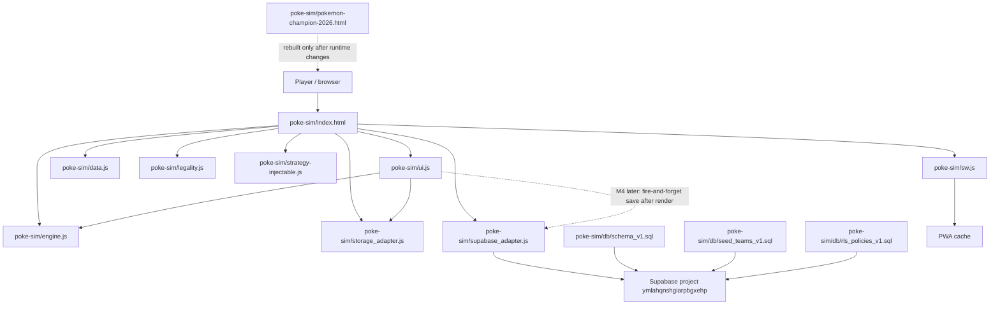

# Alfredo DB Handoff - M4 / POK-20

Date: 2026-04-30

## Repo Roles

- Working repo for cleanup and PRs: `TheYfactora12/Pokemon-Champions-Sim-Planner`
- Production reference repo: `alfredocox/Pokemon-Champions-Sim-Planner`
- Current handoff PR: conflict cleanup only, no M4 wiring.

Do not push directly to `alfredocox/Pokemon-Champions-Sim-Planner` unless Alfredo explicitly asks for that. After this branch is reviewed and validated, the cleaned work can be coordinated upstream against Alfredo's production `main`.

## Current PR Scope

This PR resolves the DB/Supabase conflict surface only:

- `poke-sim/supabase_adapter.js`
- `poke-sim/db/rls_policies_v1.sql`
- `poke-sim/db/README_DB.md`

This PR intentionally does not touch:

- `poke-sim/ui.js`
- `poke-sim/engine.js`
- `poke-sim/sw.js`
- `poke-sim/pokemon-champion-2026.html`
- `poke-sim/db/schema_v1.sql`
- tests

## Project Flow Diagram



## Pre-Handoff Cleanup Checklist

- Confirm this PR remains limited to DB conflict cleanup and handoff docs.
- Confirm `poke-sim/ui.js`, `poke-sim/engine.js`, `poke-sim/sw.js`, tests, schema, and bundle are untouched.
- Confirm no merge markers remain in the DB conflict files.
- Confirm no service-role key or realistic-looking secret is committed.
- Confirm Supabase project URL is documented and anon key remains placeholder-only.
- Confirm PR description names the blocked local validations.
- Review `docs/INFRA_PROJECT_QC_HANDOFF.md` before M4 implementation.
- Keep PR as review/handoff until a local browser smoke test is completed.

## Supabase Setup Order

Project URL: `https://ymlahqnshgiarpbgxehp.supabase.co`

Run these in Supabase SQL editor, in this order:

1. `poke-sim/db/schema_v1.sql`
2. `poke-sim/db/seed_teams_v1.sql`
3. `poke-sim/db/rls_policies_v1.sql`

Expected tables:

- `rulesets`
- `teams`
- `team_members`
- `prior_snapshots`
- `golden_battles`
- `analyses`
- `analysis_win_conditions`
- `analysis_logs`

## Adapter Contract To Review

The browser adapter exposes:

- `SupabaseAdapter.enabled`
- `SupabaseAdapter.DEFAULT_RULESET_ID`
- `SupabaseAdapter.loadTeamsFromDB()`
- `SupabaseAdapter.loadRulesets()`
- `SupabaseAdapter.saveAnalysis(payload)`
- `SupabaseAdapter.loadRecentAnalyses(limit)`
- `SupabaseAdapter.getMatchupHistory(playerKey, oppKey, limit)`

The adapter is intended to be fail-soft. Supabase errors should return safe fallbacks and should not break offline play.

## M4 Still Blocked

M4 persistence should not be implemented until these are reviewed:

- Confirm the adapter API above is acceptable.
- Confirm RLS policies are append-safe for anon users.
- Confirm no service-role key or hardcoded project secret is present.
- Reconcile one canonical payload builder for runtime and tests.
- Wire persistence after UI result render, fire-and-forget.
- Cap persisted logs.
- Bump `poke-sim/sw.js` cache name when runtime source changes.
- Rebuild `poke-sim/pokemon-champion-2026.html` only after runtime source conflicts are resolved.

## Validation Status

Completed in this cleanup branch:

- Merge markers removed from the three target files.
- Scope check confirms only DB conflict files plus this handoff doc changed.
- Security scan found only placeholder credential examples.

Blocked locally:

- Node syntax/test execution is blocked by `Access is denied` for `node.exe`.
- Browser automation is expected to be blocked by the same Node execution issue.

Required before M4 PR:

```bash
cd poke-sim
node tests/items_tests.js
node tests/status_tests.js
node tests/mega_tests.js
node tests/coverage_tests.js
node tests/t9j8_tests.js
node tests/t9j9_tests.js
node tests/t9j10_tests.js
node tests/t9j11_tests.js
node tests/t9j12_tests.js
node tests/t9j13_tests.js
node tests/t9j14_tests.js
node tests/t9j15_tests.js
node tests/t9j16_tests.js
node tests/audit.js
```

## App Smoke Test Checklist

Yes, the app should be run before M4 wiring. For this cleanup PR, the goal is only to confirm the app still loads because runtime UI and engine files were not changed.

Manual browser smoke:

- Open `poke-sim/pokemon-champion-2026.html` through a local static server.
- Confirm the app loads without a blank screen.
- Run one single simulation.
- Run all matchups.
- Confirm the browser console has no JavaScript errors.
- Confirm Supabase unavailable does not block the UI.

Do not treat this cleanup PR as M4 complete. It only makes the DB surface reviewable.
